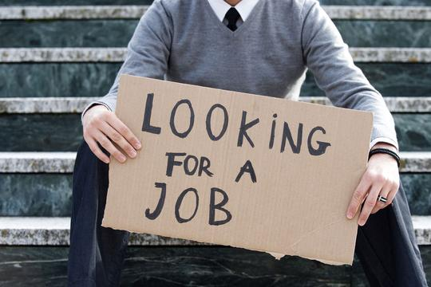

```{r setup, echo=FALSE, results='hide', message=FALSE, warning=FALSE}
# Če želimo nastaviti pisave v PDF-ju, odkomentiramo
# in sledimo navodilom v programu.
#source("fontconfig.r", encoding="UTF-8")

# Uvoz vseh potrebnih knjižnic
source("lib/libraries.r", encoding="UTF-8")
```

```{r rstudio, echo=FALSE, results='asis'}
# Izris povezave do RStudia na Binderju
source("lib/rstudio.r", encoding="UTF-8")
```

# Izbira teme-uvod

V projektu bom analizirala brezposelnost v Sloveniji.

Z analizo podatkov bom poskusila najti vzporednice med 
brezposelnostjo in stopnjo izobrazbe,  
brezposelnostjo in trajanjem iskanja dela, 
kolikšna je brezposelnost po različnih regijah v Sloveniji 
ter nekatere druge primerjave.


<center>


# Obdelava, uvoz in čiščenje podatkov

```{r uvoz, echo=FALSE, message=FALSE}
source("uvoz/uvoz_s.r", encoding="UTF-8")
```

Uvozila sem podatke, ki sem jih pridobila na spletni strani Statističnega urada Republike Slovenije.
Uredila sem jih v obliko *tidy data*.


 1. TABELA: (brezposelnost_po_statisticnih_regijah: Stopnja brezposelnosti po statističnih regijah v Sloveniji):

- 1.  leto - spremenljivka: leto, v katerem so bile opravljene meritve
- 2.  regija - spremenljivka: regija, v kateri so opravljali meritve
- 3.  stopnja_brezposelnosti - meritev: brezposelnost v procentih

 2. TABELA: (slovenija: Brezposelnost glede na celotno Slovenijo na 1000 prebivalcev)

- 1.  leto - spremenljivka: leto, v katerem so bile opravljene meritve
- 2.  brezposelnost - meritev: brezposelnost na 1000 prebivalcev

 3.TABELA: (trajanje: Brezposelnost po trajanju iskanja dela za celotno Slovenijo)

- 1.  cas - koliko časa so ljudje brezposelni
- 2.  leto - spremenljivka: leto, v katerem so bile opravljene meritve
- 3.  brezposelnost - meritev: brezposelnost na 1000 prebivalcev

 4.TABELA: (izobrazba: Brezposelnost glede na stopnjo dosežene izobrazbe)

- 1.  leto - spremenljivka: leto, v katerem so bile opravljene meritve
- 2.  izobrazbe - spremenljivka: dosežena stopnja izobrazbe (Brez izobrazbe, Osnovnošolska, Nižja ali srednja poklicna, Srednja strokovna-splošna, Višješolska-visokošolska	)
- 3.  brezposelnost - meritev: brezposelnost na 1000 prebivalcev

 5.TABELA: (aktivnosti: Delovno sposobni glede na aktivnost in mere aktivnosti po starostnih skupinah in spolu za celotno Slovenijo)

- 1.  starostna_skupina - spremenljivka: koliko so stari tisti na katerih so opravljene meritve
- 2.  spol - spremenljivka: moški ali ženski
- 3.  leto - spremenljivka: leto, v katerem so bile opravljene meritve
- 4.  meritve - spremenljivka: meritve so bile izvedene glede na to ali so ljudje brezposelni, aktivni, delovno aktivni ali neaktivni
- 5.  delovno_sposobni - meritev: Število ljudi ki so brezposelni, aktivni, delovno aktivni in neaktivni


SPLETNE POVEZAVE DO TABEL:

- [Stopnja brezposelnosti po statističnih regijah v Sloveniji](<https://pxweb.stat.si/SiStatDb/pxweb/sl/10_Dem_soc/10_Dem_soc__07_trg_dela__02_07008_akt_preb_po_anketi__02_07621_akt_preb_ADS_letno/0762115S.px/>)

- [Brezposelnost glede na celotno Slovenijo na 1000 prebivalcev](<https://pxweb.stat.si/SiStatDb/pxweb/sl/10_Dem_soc/10_Dem_soc__07_trg_dela__02_07008_akt_preb_po_anketi__02_07621_akt_preb_ADS_letno/0762103S.px/table/tableViewLayout2/>)

- [Brezposelnost po trajanju iskanja dela](<https://pxweb.stat.si/SiStatDb/pxweb/sl/10_Dem_soc/10_Dem_soc__07_trg_dela__02_07008_akt_preb_po_anketi__02_07621_akt_preb_ADS_letno/0762111S.px/>)

- [Brezposelnost po stopnji dosežene izobrazbe](<https://pxweb.stat.si/SiStatDb/pxweb/sl/10_Dem_soc/10_Dem_soc__07_trg_dela__02_07008_akt_preb_po_anketi__02_07621_akt_preb_ADS_letno/0762112S.px/>)

- [Delovno sposobni glede na aktivnost in mere aktivnosti po starostnih skupinah in spolu za celotno Slovenijo](<https://pxweb.stat.si/SiStatDb/pxweb/sl/10_Dem_soc/10_Dem_soc__07_trg_dela__02_07008_akt_preb_po_anketi__01_07620_akt_preb_ADS_cetrt/0762003S.px/>)


***

# Analiza in vizualizacija podatkov


```{r vizualizacija, echo=FALSE, message=FALSE, warning=FALSE, results='hide'}
source("vizualizacija/vizualizacija_sabrina.r", encoding="UTF-8")
```

Za začetek bi rada predstavila kako se je brezposelnost spreminjala v zadnjih desetih letih glede na celotno Slovenijo. Opazimo lahko, da je največja stopnja brezposelnosti dosežena leta 2013.

```{r graf 1, echo=FALSE, fig.align='center', fig.cap='Graf 1'}
plot(osnovni_graf)
```

V nadaljevanju, nas bo zanimala bolj podrobna slika brezposelnosti v Sloveniji, zato si oglejmo graf brezposelnosti po statističnih regijah, ter zlahka opazimo, da je bil višek brezposelnosti v Pomurski in Zasavski regiji.


```{r graf 2, echo=FALSE, fig.align='center', fig.cap='Graf 1'}
plot(vec_graf)
```


Poglejmo to še na zemljevidu Slovenije in sicer najprej za leto 2010, ter nato še za leto 2018.

```{r zemljevid 1, echo=FALSE, fig.align='center', fig.cap='Zemljevid 1'}
plot(zemljevid.brezposelnost.2010)
```

```{r zemljevid 2, echo=FALSE, fig.align='center', fig.cap='Zemljevid 1'}
plot(zemljevid.brezposelnost.2018)
```

Iz zemljevidov je razvidno, da je brezposelnost višja v odročnih krajih Slovenije. Leta 2010 je bila brezoselnost najvišja v Prekmurju in sier 11.7, takoj za njo pa je posavska regija z 9.1 in Podravska z 9.0 procenta.
Leta 2018 je slika nekoliko spremenjena. Še vedno je brezposelnost najvišja v Prekmorju vendar se je le ta znižala na 9.2 procenta, medtem ko je v Primorsko-notranjski regiji iz 4.5 narasla na 7.0 procenta. Kar nakazuje na prej omenjen problem odročnih krajev. 


***
Omenili smo že, da nas bo zanimala povezava med brezposelnostjo in stopnjo dosežene izobrazbe.

```{r graf 3, echo=FALSE, fig.align='center', fig.cap='Graf 1'}
plot(graf_izobrazba)
```

Vidimo, da je največ brezposelnih tistih s končano srednjo strokovno oz splošno šolo, takoj za njimi so tisti z nižjo ali srednjo poklicno. Najmanj brezposelnih je brez izobrazbe. Vendar tu moramo biti pazljivi, saj se število ljudi znotraj razdelka razlikuje. Vemo da je tistih brez izobrazbe bistveno manj kot tistih s katerokoli izobrazbo, tako da je rezultat pričakovan, analiza pa ne najboljša. 

***


```{r graf 4, echo=FALSE, fig.align='center', fig.cap='Graf 1'}
plot(graf_trajanje)
```

Največ je takih brezposelnih, ki delo iščejo že več kot leto dni. Presenetljivo pa je takoj za tem število brezposelnih ki delo iščejo od 1 do 5 mesecev.


***
# Napredna analiza podatkov

```{r analiza, echo=FALSE, message=FALSE}
source("analiza/analiza_sabrina.r", encoding="UTF-8")
```


```{r graf 5, echo=FALSE, fig.align='center', fig.cap='Graf 1'}
plot(graf_regresija)
```

S polinomom druge stopnje sem prikazala, kako lahko na podlagi vrednosti brezposelnosti v Sloveniji iz prejšnjih let napovemo vrednost brezposelnosti v prihodnosti do leta 2021. Vemo, da na brezposelnost poleg njenega gibanja v prejšnjih letih vpliva še veliko drugih dejavnikov, zato se na to napoved ne moremo zares zanesti.


***

Na koncu sem primerjala še veliko različnih spremenljivk. In sicer me je zanimalo, koliko ljudi je aktivnih, brezposelnih, neaktivnih in delovno aktivnih. Primerjala sem glede na spol ter starostno skupino. 

```{r shiny, echo=FALSE}
shinyAppDir("shiny", options=list(width="100%", height=600))
```


.


Izkazalo se je, da je pri obeh spolih aktivnost v zadnjih 10 letih ravno nasprotna. Če primerjamo starostni skupini 15-24 let, ter 55-64 let opazimo, da je graf mlajše generacije padajoča krivulja, medtem ko je delovno aktivnih starih med 55-64 let skozi leta vedno več. To nakazuje na današnji daljši študij mladih generacij, ter podaljšano življensko dobo in kasnejši odhod v penzijo pri starejših generacijah.
Pri primerjavi brezposelnosti smo ugotovili, da je starejših žensk več brezposelnih kot moških, ter da se brezposelnost s starostjo povečuje.


***
# Zaključek
V svoji seminarski nalogi sem ugotovila, da je bila v Sloveniji najvišja stopnja brezposelnosti leta 2013, ter da je brezposelnost najvišja v odročnih krajih Slovenije (Pomurje).
Brezposelnost se je danes zmanjšala, poleg tega pa se je struktura delovne aktivnosti zelo spremenila glede na starost prebivalstva. Danes veliko mladih študira, zato je le teh malo zaposlenih. Se pa delovna aktivnost zelo podaljšuje, zato je vedno več starejših ki še dela. Brezposelnost pa je pri mladih generacijah manjša v primerjavi s starejšo populacijo. 


